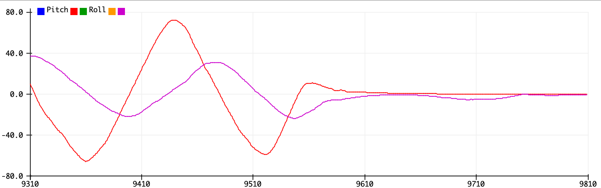
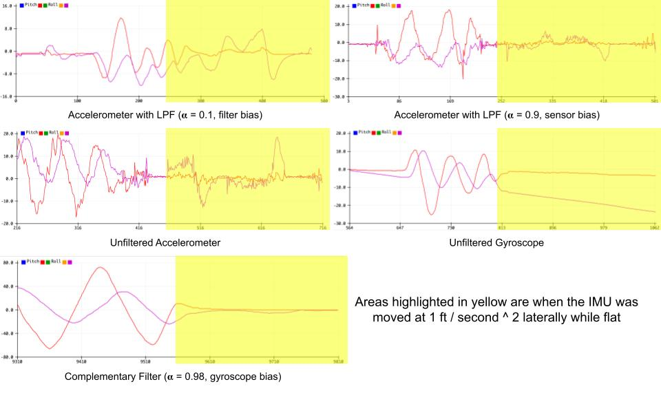

<h1 align="center">
   
  
   
  SimpleFusion
   
</h1>

 
  A library that fuses accelerometer and gyroscope readings quickly and easily with a complementary filter.
 
	
	
 

## Overview
This library combines accelerometer (in meters / second &sup2;) and gyroscope (in radians / second) data to output the IMU's rotation (Euler angles). It is accurate
up to &plusmn; 90 degrees. 

## Benefits
Here's a comparison of different high-speed methods for estimating pitch and roll.

 

 

The complementary filter returns smooth readings despite non-zero acceleration.

## License

<a href="LICENSE">MIT<a>
